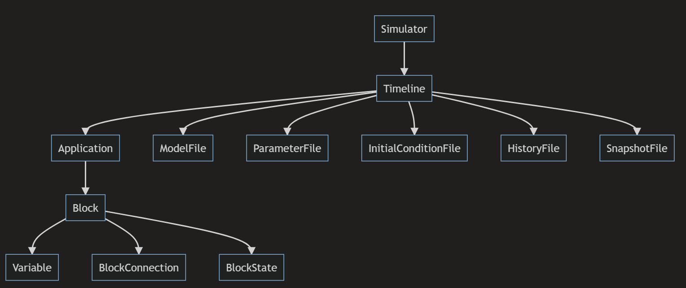
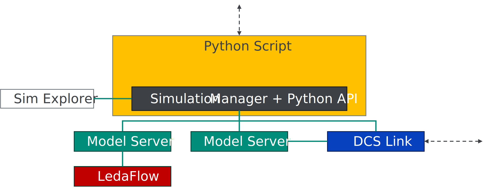

# **K-Spice Python API**
Summary: A short document on how to get up and running with the Python API

> **NOTE:** The API is under active development. The guide provided here might not be compatible with the K-Spice version you are running. Built-in Python [help](https://docs.python.org/3/library/functions.html#help) function will give up to date info about functions and types in the K-Spice module.

# Installation
1.	Copy the API file from the internal tools [in the KSpice built](https://artprodsu6weu.artifacts.visualstudio.com/A7e7d63c7-ba47-433d-affd-94b30e159ada/c918a51b-bf39-432a-ad36-0d1840f6bf79/_apis/artifact/cGlwZWxpbmVhcnRpZmFjdDovL2tvZ25pZmFpL3Byb2plY3RJZC9jOTE4YTUxYi1iZjM5LTQzMmEtYWQzNi0wZDE4NDBmNmJmNzkvYnVpbGRJZC8zMzk3OTcvYXJ0aWZhY3ROYW1lL0ludGVybmFsVG9vbHM1/content?format=zip&subPath=%2Fpython)
2.	Paste the .pyd library into your K-Spice install bin64
	«C:\Program Files (x86)\Kongsberg\K-Spice\bin64»

# Importing the K-Spice Module into Python

```python
import sys
sys.path.append(r"C:/Program Files (x86)/Kongsberg/K-Spice/bin64")
import kspice
from kspice import Simulator

# useful package for handling time data
from datetime import timedelta
```
_Note: Appending the path from python might not always work, depending on your Workspace / Python IDE. 
Instead, try starting Python out of the directory ``"C:/Program Files (x86)/Kongsberg/K-Spice/bin64"`` and if calling the API from there works, add the path to your EnvironmentVariables (Windows: ``PYTHONPATH``)_


#Starting and Running K-Spice
In order to get commands from the Python API to K-Spice, K-Spice needs to be launched from the Python script. Models (and sim managers) already running cannot be controlled from Python. Make sure to shut down existing simulations and sim managers first.

```python
sim = kspice.Simulator(r"C:\K-Spice-Projects\DemoProject")

timeline = sim.activate_timeline("Engineering")
```

All other API calls are made on the timeline object, the hierachy is as follows:

Example scripts can be found in the repository.

# Architecture
The python API acts as a wrapper for the K-Spice SimulationManager process.
This means you can not interact with the front-end of K-Spice. However, the SimExplorer.exe process can be started in addition to the running python process invoking simulation manager, and you can connect to the simulation manager in the usual way through tcp/ip on port 16000.



For the full spectrum of available commands and functions refer to version specific html documentation following the K-Spice Python API.
docs -> index.html
